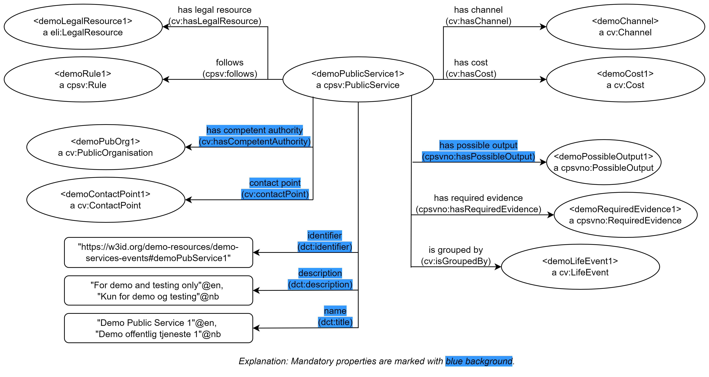

== Purpose [[purpose]]

This showroom is meant to 

* demonstrate how to use CPSV-AP-NO to describe services and events;
* demonstrate some cross-references between services/events and other resources demonstrated in some of the other showrooms;
* provide reusable, machine-readable descriptions of services and events, for testing and demonstration purposes.

*_Disclaimer_*: _The machine-readable demo services and events are meant for demo purposes only. They do not represent any real world phenomena at all. On the other hand, they are supposed to syntactically conform to CPSV-AP-NO._ 

== Demo resources in this showroom [[demo-resources]]

In this showroom we have a https://w3id.org/demo-resources/demo-services-events#exKatalog[catalog of demo services and demo events]. Since the demo examples are trying to be "technically complete", only some of the classes and properties are explained here. 

[[img-demo-publicService1]]
.Graphical illustration of the "Demo Public Service 1". 
[link=images/demoPublicService1-explanation.png]

<> illustrates the "https://w3id.org/demo-resources/demo-services-events#demoPubService1[Demo Public Service 1]" that is in the catalog: 

* This demo public service has the following annotation properties which are all mandatory:
** name: "Demo Public Service 1" in English, and "Demo offentlig tjeneste 1" in Norwegian Bokmål,
** description: "For demo and testing only" in English, and "Kun for demo og testing" in Norwegian Bokmål, 
** identifier: "\https://w3id.org/demo-resources/demo-services-events#demoPubService1".

* This public service
** has https://data.norge.no/showroom/cpsv-ap-no/demo-services-events#demoPossibleOutput1[<demoPossibleOutput1>] as a possible output,
** has https://data.norge.no/showroom/cpsv-ap-no/demo-services-events#demoReqEvidence1[<demoReqEvidence1>] as a required evidence,
** is grouped by, or supports, https://w3id.org/demo-resources/demo-services-events#demoLifeEvent1[<demoLifeEvent1>].

* This public service has
**  https://w3id.org/demo-resources/demo-services-events#demoPubOrg1[<demoPubOrg1>] as its competent authority,
** https://w3id.org/demo-resources/demo-services-events#demoContactPoint1[<demoContactPoint1>] as its contact point.

* This public service 
** is available via the channel https://w3id.org/demo-resources/demo-services-events#demoChannel[<demoChannel>],
** has https://w3id.org/demo-resources/demo-services-events#demoCost1[<demoCost1>] as the cost.

* This public service
** follows the rule https://w3id.org/demo-resources/demo-services-events#demoRule1[<demoRule1>],
** has https://w3id.org/demo-resources/demo-services-events#demoLegalResource1[<demoLegalResource1>] as a related legal resource.
 
== Some cross-references with other demo resources [[cross-references]]

*_Note_*: _Not all possible cross-references are demonstrated in this showroom. The lists are thus not exhaustive._

*Services/events and classifications*, for example: 

* When describing a service/event/etc., and where coded values are used, the coded values should preferably be chosen from controlled vocabularies (i.e., classifications). 
** Examples of properties with coded values are https://data.norge.no/specification/cpsv-ap-no#OffentligTjeneste-dekningsomr%C3%A5de[spatial coverage (dct:spatial) &#x29C9;,  window="_blank", role="ext-link"], https://data.norge.no/specification/cpsv-ap-no#OffentligTjeneste-hovedform%C3%A5l[functions of government (dct:type) &#x29C9;,  window="_blank", role="ext-link"], https://data.norge.no/specification/cpsv-ap-no#OffentligTjeneste-status[status (adms:status) &#x29C9;,  window="_blank", role="ext-link"] etc., which are demonstrated in e.g. the "https://w3id.org/demo-resources/demo-services-events#demoPubService1[Demo Public Service 1]".    
** Classifications should therefore be made available, also machine-readably.

*Services/events and concepts*, for example: 

* A service/event/etc., may refer to concepts that are relevant for understanding the service/event/etc.  
** For example, our "https://w3id.org/demo-resources/demo-services-events#demoPubService1[Demo Public Service 1]" refers to "demo concept 1" that is demonstrated in our link:/showroom/skos-ap-no/[showroom with demo concepts].

*Services/events and datasets*, for example: 

* A required evidence that is needed in order to execute a service, may be a part of a dataset. 
**  For instance, the required evidence https://w3id.org/demo-resources/demo-services-events#demoReqEvidence1[<demoRequiredEvidence1>] to our 
https://w3id.org/demo-resources/demo-services-events#demoService1[<demoPublicService1>] is part of the dataset https://w3id.org/demo-resources/dummy-datasets#dmyDataset1[Dummy dataset 1]. Datasets are demonstrated in our link:/showroom/dcat-ap-no/[showroom with demo datasets].

* Similarly, a possible output from a service may be a part of a dataset. 
**  For instance, the possible output https://w3id.org/demo-resources/demo-services-events#demoPossibleOutput1[<demoPossibleOutput1>] of our https://w3id.org/demo-resources/demo-services-events#demoService1[<demoPublicService1>] is a part of the dataset https://w3id.org/demo-resources/dummy-datasets#dmyDataset1[Dummy dataset 1].

* An event may be described at a dataset. 
** For instance our https://w3id.org/demo-resources/demo-services-events#demoEvent1[<demoEvent1>] is described at the dataset https://w3id.org/demo-resources/dummy-datasets#dmyDataset1[Dummy dataset 1]. Datasets may then be distributed using distribution or data services, which makes it possible to distribute events / event streams. This is demonstrated in our link:/showroom/dcat-ap-no/[showroom with demo datasets].

*Services/events and information models*, for example: 

* A required evidence that is needed to execute a service, or the possible output from a service, may a part of a dataset and thus may conform to one or more standards (incl. information models).
** This is demonstrated and explained in our link:/showroom/dcat-ap-no[showroom with demo datasets].  

== _to the overview of the showrooms_ [[to-overview]]

link:/showroom/overview/#overview[Click here for the overview of all the showrooms]