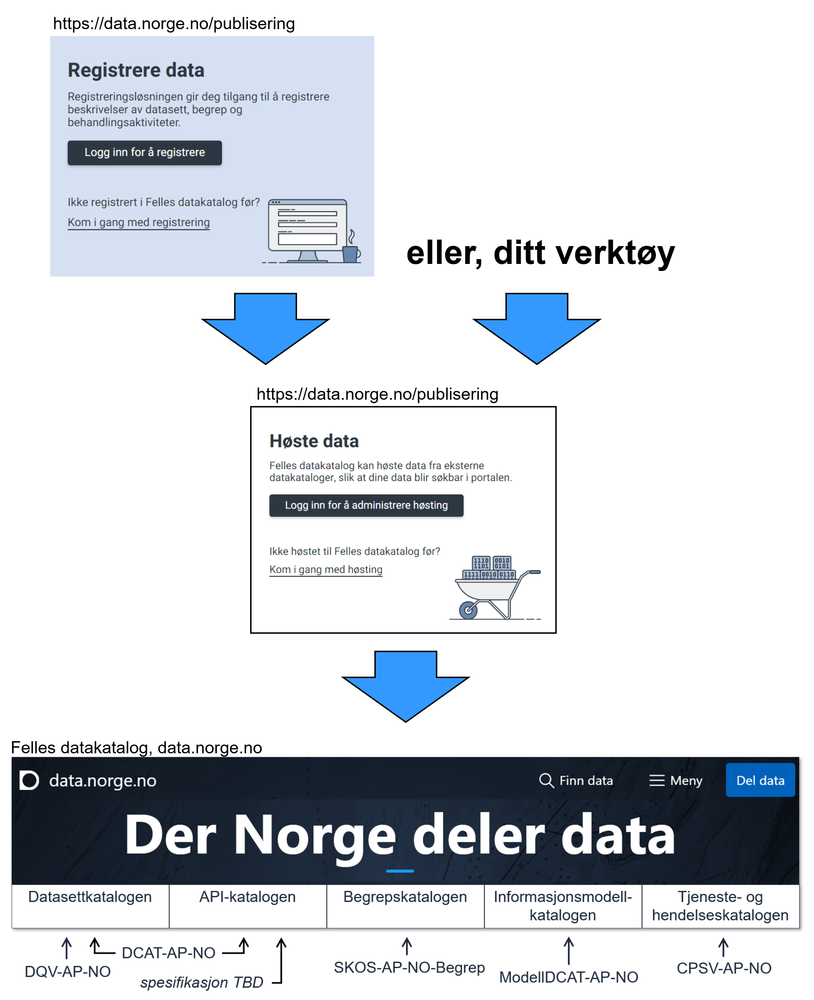

== Å gjøre ressursene dine oppdagbare via en dataportal [[about-demo-portal]]

Spesifikasjonene som er demonstrert bruken av i de ulike utstillingsrommene her, er også spesifikasjoner for hvordan ressursbeskrivelser (metadata) tilgjengeliggjøres via en dataportal, spesielt den nasjonale https://data.norge.no/[Felles datakatalog &#x29C9;, window="_blank", role="ext-link"] forvaltet av Digitaliseringsdirektoratet (Digdir).

For å tilgjengeliggjøre ressursbeskrivelsene via Felles datakatalog, kan du, hvis du er autorisert til å gjøre det på vegne av din virksomhet, 

* bruke registreringstjenesten, til å registrere datasett, begreper osv., som vil automatisk bli innhøst til Felles datakatalog, eller
* bruke høstingstjenesten, til å spesifisere URLer der dine maskinprosesserbare ressursebeskrivelser er gjort tilgjengelig, for automatisk innhøsting til Felles datakatalog. 

Dette er illustrert i <> som også viser bruken av de ulike nasjonale spesifikasjonene i Felles datakatalogen. 

[[img-registering-n-harvesting]]
.Gjøre dine ressursbeskrivelser tilgjengelige og oppdagbare via Felles datakatalog.  
[link=images/registering-n-harvesting-nb.png]

Digdir tilbyr også en https://demo.fellesdatakatalog.digdir.no/[demoportal &#x29C9;, window="_blank", role="ext-link"]. Demoportalen har samme funksjonaliteter som i Felles datakatalog, men innholdet i demoportalen er bare ment for testing og demo. Merk at du må være registrert bruker for å kunne bruke registrerings- og/eller høstingstjenesten av demoportalen. 

Ved å bruke høstingstjenesten, er de aller fleste ressursene demonstrert i de ulike utstillingsrommene her allerede automatisk innhøstet til og dermed oppdagbare via demoportalen. 

Eksempler på hvordan du skal finne demoressursene i demoportalen:

* demo klassifikasjon/datasett: ved f.eks. https://demo.fellesdatakatalog.digdir.no/datasets?q=demodataset[å søke på "demodataset" i datasettdelen av demoportalen &#x29C9;, window="_blank", role="ext-link"].
* demobegreper (#ikke ennå#): ved f.eks. https://demo.fellesdatakatalog.digdir.no/concepts?q=demoCpt[å søke på "demoCpt" i begrepsdelen av demoportalen &#x29C9;, window="_blank", role="ext-link"]. 
* demoinformasjonsmodeller: ved f.eks. https://demo.fellesdatakatalog.digdir.no/informationmodels?q=demomodel[å søke på "demomodel" i informasjonsmodelldelen av demoportalen &#x29C9;, window="_blank", role="ext-link"].

