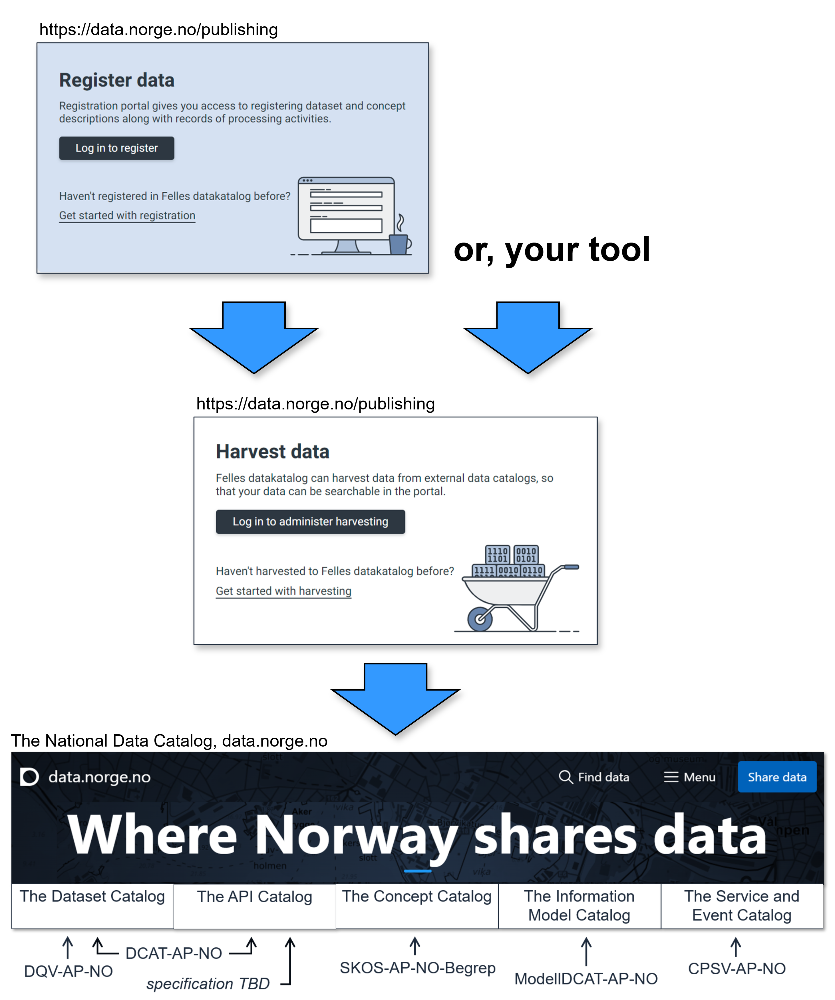

== Making the resources findable via a data portal [[about-demo-portal]]

The Norwegian national specifications demonstrated in the various showrooms here, are also specifications for how to make the resource descriptions (metadata) available in a data portal, and in particular, https://data.norge.no/[the National Data Catalog of Norway &#x29C9;, window="_blank", role="ext-link"] maintained by the Norwegian Digitalisation Agency.  

In order to make the resource descriptions available in the National Data Catalog, you may, if you are authorized to do so on behalf of your organization, 

. use the registration services, to register your datasets, concepts etc., which will then be automatically harvested to the National Data Portal, or 
. use the harvesting services, to specify the URLs where your machine-readable resource descriptions are made available for harvesting to the National Data Catalog.

This is illustrated in <>, which also shows the usage of the national specifications in the data portal. 

[[img-registering-n-harvesting]]
.Making your resource descriptions available and findable through the National Data Catalog.
[link=images/registering-n-harvesting-en.png]

There is also a https://demo.fellesdatakatalog.digdir.no/[demo portal &#x29C9;, window="_blank", role="ext-link"] provided by the Norwegian Digitalisation Agency, which has the same functionalities as in the National Data Catalog, but the content in the demo portal is only meant for testing and demonstration purposes. Note that you need to be a registered user in the demo portal in order to use the editor and/or harvester of the demo portal. 

Using the harvesting services, all the demo resources that are demonstrated in the various showrooms here are, or will be, automatically harvested to and thus also findable via the demo portal. 

Examples for how to find some of the demo resources in the demo portal:

* demo classifications / datasets: by for instance https://demo.fellesdatakatalog.digdir.no/datasets?q=demodataset[searching "demodataset" in the "Datasets" part of the demo portal &#x29C9;, window="_blank", role="ext-link"].
* demo concepts (#not yet#): by for instance https://demo.fellesdatakatalog.digdir.no/concepts?q=demoCpt[searching "demoCpt" in the "Concepts" part of the demo portal &#x29C9;, window="_blank", role="ext-link"]. 
* demo information models: by for instance https://demo.fellesdatakatalog.digdir.no/informationmodels?q=demomodel[searching "demomodel" in the "Information models" part of the demo portal &#x29C9;, window="_blank", role="ext-link"].

