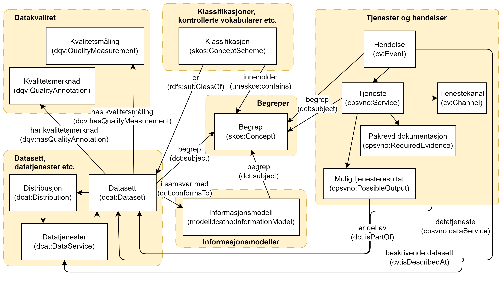

== Oversikt over og kryssreferanser mellom utstillingsrommene [[overview]]

Vi har så langt følgende utstillingsrom:

* link:/showroom/skos-ap-no/[Begreper]: I dette utstillingsrommet vil vi demonstrere bruken av https://data.norge.no/specification/skos-ap-no-begrep[Forvaltningsstandard for begrepsbeskrivelser (SKOS-AP-NO-Begrep) &#x29C9;, window="_blank", role="ext-link"] (norsk applikasjonsprofil av W3C sin https://www.w3.org/2004/02/skos/[SKOS &#x29C9;, window="_blank", role="ext-link"]), til å beskrive og tilgjengeliggjøre maskinprosesserbare begreper og begrepssamlinger, med kryssreferanser til noen av de andre demoressursene dekket av de andre spesifikasjonene.

* link:/showroom/dcat-ap-no/[Datasett,  datatjenester osv.]: I dette utstillingsrommet vil vi demonstrere bruken av https://data.norge.no/specification/dcat-ap-no["Standard for beskrivelse av datasett, datatjenester og datakataloger (DCAT-AP-NO) &#x29C9;", window="_blank", role="ext-link"] (norsk applikasjonsprofil av EU sin https://github.com/SEMICeu/BregDCAT-AP[BRegDCAT-AP &#x29C9;, window="_blank", role="ext-link"]), til å beskrive og tilgjengeliggjøre maskinprosesserbare beskrivelser av datakataloger med datasett, datatjenester og distribusjoner, med kryssreferanser til noen av de andre demoressursene dekket av de andre spesifikasjonene.

* link:/showroom/modelldcat-ap-no/[Informasjonsmodeller]: I dette utstillingsrommet vil vi demonstrere bruken av https://data.norge.no/specification/modelldcat-ap-no[Spesifikasjon for beskrivelse av informasjonsmodeller (ModellDCAT-AP-NO) &#x29C9;, window="_blank", role="ext-link"] (norsk applikasjonsprofil av https://data.norge.no/specification/dcat-ap-no[DCAT-AP-NO &#x29C9;, window="_blank", role="ext-link"]), til å beskrive og tilgjengeliggjøre maskinprosesserbare beskrivelser av informasjonsmodeller og modellkataloger, med kryssreferanser til noen av de andre demoressursene dekket av de andre spesifikasjonene. 

* link:/showroom/xkos-ap-no/[Klassifikasjoner, kontrollerte vokabularer osv.]: I dette utstillingsrommet vil vi demonstrere bruken av https://data.norge.no/specification/xkos-ap-no[Spesifikasjon for klassifikasjonsbeskrivelser (XKOS-AP-NO)  &#x29C9;, window="_blank", role="ext-link"] (norsk applikasjonsprofil av DDI sin https://rdf-vocabulary.ddialliance.org/xkos.html[XKOS &#x29C9;, window="_blank", role="ext-link"]), til å beskrive og tilgjengeliggjøre maskinprosesserbare klassifikasjoner, kontrollerte vokabularer, kodelister osv., med kryssreferanser til noen av de andre demoressursene dekket av de andre spesifikasjonene.  

* link:/showroom/cpsv-ap-no/[Tjenester og hendelser]: I dette utstillingsrommet vil vi demonstrere bruken av https://informasjonsforvaltning.github.io/cpsv-ap-no/[Spesifikasjon for tjeneste- og hendelsesbeskrivelser (CPSV-AP-NO) &#x29C9;, window="_blank", role="ext-link"] (norsk applikasjonsprofil av EU sin https://github.com/SEMICeu/CPSV-AP[CPSV-AP &#x29C9;, window="_blank", role="ext-link"]), til å beskrive tjenester og hendelser og tilgjengeliggjøre maskinprosesserbare beskrivelser, med kryssreferanser til noen av de andre demoressursene dekket av de andre spesifikasjonene. 

* link:/showroom/demo-uris/[Persistente URIer]: "Masternøkkelen" til utstillingsrommene er URI. I dette utstillingsrommet vil vi demonstrere en måte å implementere https://www.digdir.no/standarder/peikarar-til-offentlege-ressursar-pa-nett/1492[norsk URI-standard - Peikarar til offentlege ressursar på nett &#x29C9;, window="_blank", role="ext-link"] (basert på EU sine https://joinup.ec.europa.eu/collection/semantic-interoperability-community-semic/document/10-rules-persistent-uris[10 regler for persistente URIer &#x29C9;, window="_blank", role="ext-link"]). 

* link:/showroom/dummy-assets[Generiske dummy-ressurser]: Ikke direkte relatert til noen spesifikke spesifikasjoner per se, inneholder dette utstillingsrommet noen gjenbrukbare, maskinprosesserbare og generiske dummy-ressurser som kan brukes som "byggeklosser" når du f.eks. tester din implementering av en gitt spesifikasjon.

<> illustrerer noen av kryssreferansene mellom ressurstypene som er demonstrert i de ulike utstillingsrommene. Kryssreferansene vil bli forklart nærmere i de enkelte utstillingsrommene.

[[img-overview]]
.Oversikt over og kryssreferanser mellom  utstillingsrommene.
[link=images/crossreferencing-nb.png]

