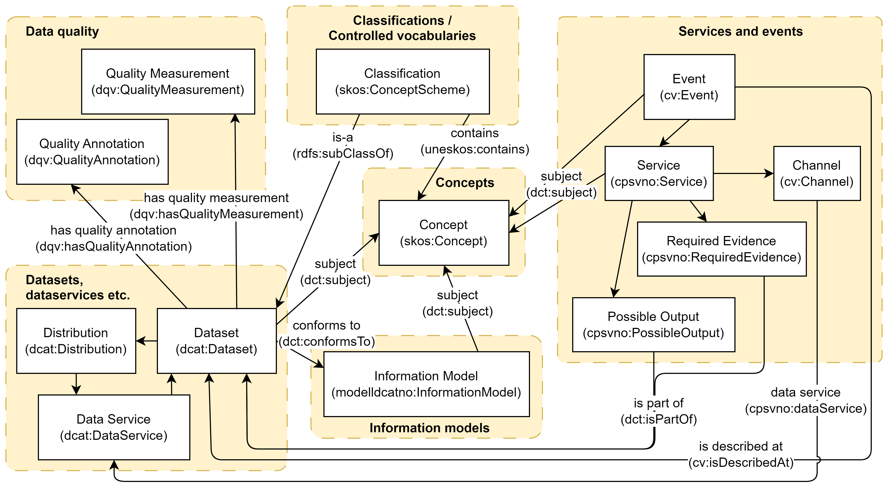

== Overview and cross-references between the showrooms [[overview]]

We have currently following showrooms with cross-references between the showrooms:

* link:/showroom/xkos-ap-no/[Demo classifications / controlled vocabularies]: In this showroom we will demonstrate the usage of https://data.norge.no/specification/xkos-ap-no[XKOS-AP-NO  &#x29C9;, window="_blank", role="ext-link"] (the Norwegian application profile of DDI's https://rdf-vocabulary.ddialliance.org/xkos.html[XKOS &#x29C9;, window="_blank", role="ext-link"]), to describe and publish machine-readable classifications, controlled vocabularies, code lists etc. 

* link:/showroom/skos-ap-no/[Demo concepts]: In this showroom we will demonstrate the usage of https://data.norge.no/specification/skos-ap-no-begrep[SKOS-AP-NO-Begrep  &#x29C9;, window="_blank", role="ext-link"] (the Norwegian application profile of W3C's https://www.w3.org/2004/02/skos/[SKOS &#x29C9;, window="_blank", role="ext-link"]), to describe and publish machine-readable concepts and concept collections.     

* link:/showroom/dcat-ap-no/[Demo datasets]: In this showroom we will demonstrate the usage of https://data.norge.no/specification/dcat-ap-no[DCAT-AP-NO &#x29C9;, window="_blank", role="ext-link"] (the Norwegian application profile of EU's https://github.com/SEMICeu/BregDCAT-AP[BRegDCAT-AP &#x29C9;, window="_blank", role="ext-link"]), to describe and publish machine-readable descriptions of datasets with distributions and data services. 

* link:/showroom/modelldcat-ap-no/[Demo information models]: In this showroom we will demonstrate the usage of https://data.norge.no/specification/modelldcat-ap-no[ModellDCAT-AP-NO &#x29C9;, window="_blank", role="ext-link"] (the Norwegian application profile of https://data.norge.no/specification/dcat-ap-no[DCAT-AP-NO &#x29C9;, window="_blank", role="ext-link"]), to describe and publish machine-readable descriptions of information models.  

* link:/showroom/cpsv-ap-no/[Demo services and events]: In this showroom we will demonstrate the usage of https://informasjonsforvaltning.github.io/cpsv-ap-no/[CPSV-AP-NO &#x29C9;, window="_blank", role="ext-link"] (the Norwegian application profile of EU's https://github.com/SEMICeu/CPSV-AP[CPSV-AP &#x29C9;, window="_blank", role="ext-link"]), to describe services and events and publish machine-readable descriptions.  

* link:/showroom/demo-uris/[Demo URIs and dereferenced URIs]: The "master key" to the showrooms is URI. In this showroom we will demonstrate one way to implement https://www.digdir.no/standarder/peikarar-til-offentlege-ressursar-pa-nett/1492[the Norwegian URI-standard &#x29C9;, window="_blank", role="ext-link"] (based on EU's https://joinup.ec.europa.eu/collection/semantic-interoperability-community-semic/document/10-rules-persistent-uris[10 Rules for Persistent URIs &#x29C9;, window="_blank", role="ext-link"]). 

* link:/showroom/dummy-assets[Generic dummy assets]: Not directly related to one particular specification per se, but this showroom contains a number of reusable, machine-readable and generic dummy assets which may be used as "building blocks" when you e.g. test your implementation of a given specification.  

<> illustrates some of the cross-references between the resource types that are demonstrated in the various showrooms. The cross-references will be explained in the respective showrooms. 

[[img-overview]]
.Overview and cross-references between the resource types that are demonstrated in the showrooms.
[link=images/crossreferencing-en.png]

